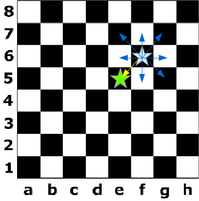
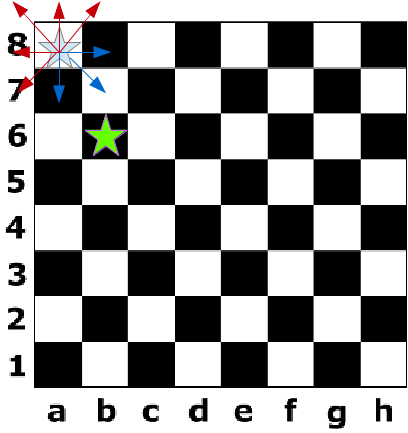

## Простые задачи

### 1
Проверить, что `n` делится на `k`.

|Ввод     | Вывод   |
|--------:|--------:|
| 10 3 |  NO     |
| 10 2 | YES     |

## Задачи про шахматную доску.

В следующих задачах вводятся две клетки, буква и цифра.
Нужно проверить, что из одной клетки можно попасть во вторую за один ход соответствующей фигуры.
### Король

| Ввод    | Вывод  |
|--------:|:-------|
|F6 E5 | YES    |
|A8 B6 | NO     |

### Ладья

| Ввод    | Вывод  |
|--------:|:-------|
|F6 F1 | YES    |
|F6 E5 | NO     |

### Слон

| Ввод    | Вывод  |
|--------:|:-------|
|F6 A1 | YES    |
|F6 F1 | NO     |

### Ферзь

| Ввод    | Вывод  |
|--------:|:-------|
|F6 A1 | YES    |
|F6 F1 | YES    |
|F6 G8 | NO     |

### Конь

| Ввод    | Вывод  |
|--------:|:-------|
|F6 A1 | NO     |
|F6 G8 | YES    |

